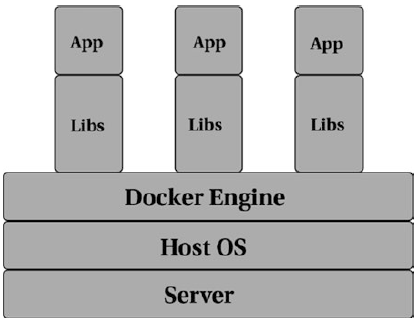
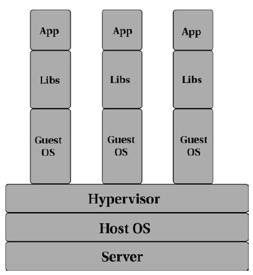
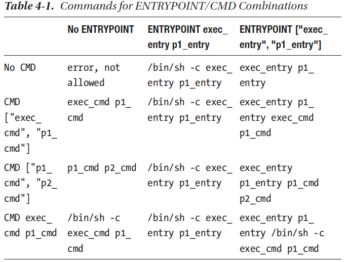

# Docker

## 1. Introducción

### ¿Qué es docker?

Docker utiliza las características de aislamiento de recursos del kernel de Linux como cgroups, espacios de nombres del kernel y OverlayFS, todo dentro de la misma máquina física o virtual. OverlayFS es un sistema de archivos con capacidad de unión que combina varios archivos y directorios en uno solo para poder ejecutar múltiples aplicaciones que están aisladas y contenidas entre sí, todo dentro de la misma máquina física o virtual.

El motor Docker proporciona una abstracción abstracción del sistema subyacente, lo que facilita a los desarrolladores probar su código

Docker resuelve el problema de despliegue y modernización de nuevas aplicaciones problema reduciendo drásticamente la superficie de la incertidumbre.  
¿Su aplicación se está modernizando? No hay problema. **Construya un nuevo contenedor con el nuevo código de la aplicación y las dependencias y envíelo.** La infraestructura existente sigue siendo la misma.   
Si la aplicación no se comporta como se espera, entonces retroceder es tan simple como volver a desplegar el contenedor anterior; no es raro que todas las imágenes Docker generadas generadas en un registro Docker. Tener una forma fácil de retroceder sin  alterar la infraestructura actual reduce drásticamente el tiempo necesario para responder a los fallos.

### Diferencia respecto a virtual machines

Mucha gente asume que como los contenedores aíslan las aplicaciones, son son lo mismo que las máquinas virtuales. A primera vista lo parece, pero la diferencia fundamental es que los contenedores comparten el mismo kernel que el host.

Docker sólo aísla un único proceso (o un grupo de procesos dependiendo de cómo se construya la imagen) y **todos los contenedores se ejecutan en el mismo sistema host**.  
Cuando se pone en marcha un contenedor, el proceso o grupo de procesos seleccionado sigue ejecutándose en el mismo host, sin necesidad de
virtualizar o emular nada.



En cambio, cuando se pone en marcha una **máquina virtual**, el hipervisor virtualiza un sistema completo, desde la CPU hasta la RAM y el almacenamiento. Para soportar este sistema virtualizado, **es necesario instalar un sistema operativo completo**.
A efectos prácticos, el sistema virtualizado es un ordenador entero que se ejecuta en un ordenador. Ahora bien, si puedes imaginar la cantidad de gastos generales que sistema operativo, ¡imagina cómo sería si ejecutaras un ¡sistema operativo anidado! La Figura muestra una representación de las tres aplicaciones que se ejecutan en tres máquinas virtuales diferentes en un único host físico.




## 4. Dockerfile

### ¿Qué es Dockerfile?
Para una aplicación tradicionalmente desplegada, construir y empaquetar una aplicación era a menudo bastante tediosa. Con el objetivo de automatizar la construcción y empaquetado de la aplicación, la gente recurrió a diferentes utilidades como GNU Make, maven, gradle, etc., para construir el paquete de la aplicación. Del mismo modo, en el mundo Docker, un Dockerfile es una **forma automatizada de construir tus imágenes Docker.**

El Dockerfile contiene **instrucciones especiales**, que indican al motor Docker Engine sobre los **pasos necesarios para construir una imagen**.  
Para invocar una construcción usando Docker, se emite el comando de Docker **`build`**.

Un archivo Dockerfile típico sería así:
```
FROM ubuntu:latest
LABEL author="sathyabhat"
LABEL description="An example Dockerfile"
RUN apt-get install python
COPY hello-world.py
CMD python hello-world.py
```

Mirando el Dockerfile, es fácil comprender lo que le estamos diciendo al motor Docker que construya. Sin embargo, no dejes que la simplicidad te engañe:  
el Dockerfile te permite construir condiciones complejas al generar tu imagen Docker. Cuando se emite un comando de construcción Docker, se construyen las imágenes Docker desde el Dockerfile dentro del contexto.

### Build Context

"Build Context" es un archivo o conjunto de archivos disponibles en una ruta o URL específica. Para entenderlo mejor, podemos tener algunos archivos de apoyo que necesitamos durante la construcción de una imagen Docker, por ejemplo, un archivo de configuración específico de la aplicación que se generó anteriormente y que necesita ser parte del contenedor.

"Build Context" puede ser local o remoto, incluso podemos establecer el "Build Context" a la URL de un repositorio Git, que puede ser útil si los archivos de origen no se encuentran en el mismo host que el demonio Docker o si queremos probar las ramas de características (feature branches). Simplemente establecemos el contexto en la rama. El comando de construcción tiene el siguiente aspecto:
```
docker build https://github.com/sathyabhat/sample-repo.
git#mybranch
```

Del mismo modo, para construir imágenes basadas en sus etiquetas Git, el comando de construcción se vería así:
```
docker build https://github.com/sathyabhat/sample-repo.
git#mytag
```

¿Trabajando en una característica a través de un pull request? ¿Quieres probar ese pull request?
No hay problema; incluso puedes establecer el contexto de una solicitud de extracción de la siguiente manera:
```
docker build https://github.com/sathyabhat/sample-repo.
git#pull/1337/head
```
**El comando `build` establece el contexto a la ruta o URL proporcionada**, subiendo los archivos al demonio Docker y permitiéndole construir la imagen. No estás limitado al contexto de construcción de la URL o la ruta. Si pasas una URL a un tarball remoto, el tarball de la URL se descarga en el demonio Docker y el comando de construcción se emite con eso como el contexto de construcción.

> **¡Atención!  **
> Si proporcionas el Dockerfile en el directorio raíz (/) y lo estableces como contexto, esto transferirá el contenido de tu disco duro al demonio Docker


### Dockerignore

Ahora deberías entender que el contexto de construcción transfiere el contenido del directorio actual al demonio Docker durante la construcción. Considere el caso en el que el directorio de contexto tiene un montón de archivos/directorios que no son relevantes para el proceso de construcción. La carga de estos archivos puede causar un aumento significativo del tráfico. **`Dockerignore`, al igual que gitignore, permite definir los archivos que están exentos de ser transferidos durante el proceso de construcción.**

La lista de ignorados es proporcionada por un archivo conocido como `.dockerignore` y cuando la CLI de Docker encuentra este archivo, modifica el contexto para excluir los archivos/patrones proporcionados en el archivo.  
Todo lo que comienza con una almohadilla (#) se considera un comentario y se ignora.  
Este es un ejemplo de archivo `.dockerignore` que excluye un directorio temporal, un directorio `.git`, y el directorio `.DS_Store` y el directorio `.DS_Store`:

```
*/temp*
.DS_Store
.git
```

### Building Using Docker Build

Volveremos al ejemplo de Dockerfile un poco más tarde. Intentemos primero un simple Dockerfile primero. Copia el siguiente contenido en un archivo y guárdalo como Dockerfile:

```
FROM ubuntu:latest
CMD echo Hello World!
```

Ahora, construye esa imagen
```
docker build .
```
Podrás ver una respuesta como esta:
```
Sending build context to Docker daemon 2.048kB
Step 1/2 : FROM ubuntu:latest
latest: Pulling from library/ubuntu
22dc81ace0ea: Pull complete
1a8b3c87dba3: Pull complete
91390a1c435a: Pull complete
07844b14977e: Pull complete
b78396653dae: Pull complete
Digest: sha256:e348fbbea0e0a0e73ab0370de151e7800684445c509d4619
5aef73e090a49bd6
Status: Downloaded newer image for ubuntu:latest
---> f975c5035748
Step 2/2 : CMD echo Hello World!
---> Running in 26723ca45a12
Removing intermediate container 26723ca45a12
---> 7ae54947f6a4
Successfully built 7ae54947f6a4
```

Podemos ver que la construcción de Docker funciona en pasos, cada paso corresponde a una instrucción del Dockerfile.  
Prueba el proceso de construcción de nuevo:

```
docker build .
Sending build context to Docker daemon 2.048kB
Step 1/2 : FROM ubuntu:latest
---> f975c5035748
Step 2/2 : CMD echo Hello World!
---> Using cache
---> 7ae54947f6a4
Successfully built 7ae54947f6a4
```

En este caso, el proceso de construcción es mucho más rápido ya que Docker ya ha cacheado las capas y no tiene que sacarlas de nuevo. Para ejecutar esta imagen utiliza el comando docker run seguido del ID de la imagen 7ae54947f6a4:

```
docker run 7ae54947f6a4
Hello World!
```

El tiempo de ejecución de Docker fue capaz de iniciar un contenedor y ejecutar el comando definido por la instrucción CMD. Por lo tanto, obtenemos la salida. Ahora, iniciar un contenedor desde una imagen escribiendo el ID de la imagen se vuelve tedioso rápidamente.  
Puedes hacer esto más fácil etiquetando la imagen con un nombre fácil de recordar. Puedes hacer esto usando el comando docker tag, como sigue:

```
docker tag image_id tag_name
docker tag 7ae54947f6a4 sathya:hello-world
```

También puede hacerlo como parte del propio proceso de construcción:

```
docker build -t sathya:hello-world .
Sending build context to Docker daemon 2.048kB
Step 1/2 : FROM ubuntu:latest
---> f975c5035748
Step 2/2 : CMD echo Hello World!
---> Using cache
---> 7ae54947f6a4
Successfully built 7ae54947f6a4
Successfully tagged sathya:hello-world
```
La última línea le indica que la imagen fue etiquetada con éxito. Puede verificar esto buscando imágenes docker de la siguiente manera:

```
docker images sathya:hello-world
REPOSITORY TAG IMAGE ID
CREATED SIZE
sathya hello-world 7ae54947f6a4
24 minutes ago 112MB
```

Docker también valida que las instrucciones del Dockerfile son válidas y en la sintaxis adecuada. Considera el Dockerfile anterior, mostrado aquí.

```
FROM ubuntu:latest
LABEL author="sathyabhat"
LABEL description="An example Dockerfile"
RUN apt-get install python
COPY hello-world.py
CMD python hello-world.py
```
Si intentas construir este Dockerfile, Docker se quejará con un error:
```
docker build -t sathyabhat:python-hello-world .
Sending build context to Docker daemon 2.048kB
Error response from daemon: Dockerfile parse error line 5: COPY
requires at least two arguments, but only one was provided.
Destination could not be determined.
```

Volveremos a solucionar este problema un poco más adelante en el capítulo. Para ahora, veamos algunas de las instrucciones de Dockerfile más utilizadas.

### Instrucciones para Dockerfile

Al mirar un Dockerfile, es muy probable que te encuentres con las siguientes
instrucciones:

- FROM
- ADD
- COPY
- RUN
- CMD
- ENTRYPOINT
- ENV
- VOLUME
- LABEL
- EXPOSE

Veamos lo que hacen:

#### FROM

Como has aprendido antes, toda imagen debe partir de una imagen base. La instrucción instrucción FROM **indica al motor Docker qué imagen base debe utilizar para instrucciones posteriores**. Todo Dockerfile válido debe comenzar con una instrucción FROM. La sintaxis es la siguiente:

```
FROM <image> [AS <name>]
```

o

```
FROM <image>[:<tag>] [AS <name>]
```

o
```
FROM <image>[@<digest>] [AS <name>]
```

Donde `<image>` es el nombre de una imagen Docker válida de cualquier repositorio público/privado. Si se omite la etiqueta, Docker obtendrá la imagen etiquetada como la más reciente. Esto se verifica con este sencillo paso. Crea un Dockerfile con contenido como se muestra aquí:

```
FROM ubuntu
CMD echo Hello World!
```
Contruye la imagen:
```
docker build .
Sending build context to Docker daemon 2.048kB
Step 1/2 : FROM ubuntu:latest
---> f975c5035748
Step 2/2 : CMD echo Hello World!
---> 7ae54947f6a4
Successfully built 7ae54947f6a4
```

Ahora modifica el Dockerfile para incluir la última etiqueta, como se muestra.
```
FROM ubuntu:latest
CMD echo Hello World!
```
Contruye la imagen:
```
docker build .
Sending build context to Docker daemon 2.048kB
Step 1/2 : FROM ubuntu:latest
---> f975c5035748
Step 2/2 : CMD echo Hello World!
---> 7ae54947f6a4
Successfully built 7ae54947f6a4
```
Puede ver en el primer paso que el hash de la imagen sigue siendo el mismo, lo que confirma que si se omite la etiqueta de la imagen, Docker obtendrá la imagen con la última etiqueta.

> **Nota:**  
> Recomendamos proporcionar siempre una etiqueta para evitar cambios inesperados que podrían no haber sido probados cuando se construyó una imagen con la última etiqueta.

#### WORKDIR

La instrucción WORKDIR **establece el directorio de trabajo actual para las instrucciones RUN, CMD, ENTRYPOINT, COPY y ADD**. La sintaxis es la siguiente:

```
WORKDIR /path/to/directory
```
WORKDIR puede establecerse varias veces en un Dockerfile y, si un directorio relativo sucede a una instrucción WORKDIR anterior, será relativo al directorio de trabajo previamente establecido. El siguiente ejemplo lo demuestra:

```
FROM ubuntu:latest
WORKDIR /usr
CMD pwd
```

Este Dockerfile obtiene la última imagen etiquetada de Ubuntu como imagen base, establece el directorio de trabajo actual en `/usr`, e imprime el directorio de trabajo actual cuando se ejecuta la imagen.

Intentemos construir y ejecutar esto y luego examinar la salida:

```
docker build -t sathyabhat:workdir .
Sending build context to Docker daemon 2.048kB
Step 1/3 : FROM ubuntu:latest
---> f975c5035748
Step 2/3 : WORKDIR /usr
---> Using cache
---> 8b0b5742b476
Step 3/3 : CMD pwd
---> Using cache
---> 4a827ca4a571
Successfully built 4a827ca4a571
Successfully tagged sathyabhat:workdir
docker run sathyabhat:workdir
/usr
```

El resultado de pwd deja claro que el directorio de trabajo actual se establece como /usr por medio de la instrucción WORKDIR.

Ahora modificaremos el Dockerfile para añadir un par de instrucciones WORKDIR:

```
FROM ubuntu:latest
WORKDIR /usr
WORKDIR src
WORKDIR app
CMD pwd
```

Ahora, contruiremos y correremos la nueva imagen:

```
docker build -t sathyabhat:workdir .
Sending build context to Docker daemon 2.048kB
Step 1/5 : FROM ubuntu:latest
---> f975c5035748
Step 2/5 : WORKDIR /usr
---> Using cache
---> 8b0b5742b476
Step 3/5 : WORKDIR src
Removing intermediate container 5b1b88e4da20
---> 5ac5d4dafe05
Step 4/5 : WORKDIR app
Removing intermediate container b9679196e934
---> b94f50750702
Step 5/5 : CMD pwd
---> Running in f78c97738bed
Removing intermediate container f78c97738bed
---> 90ebd71d1794
Successfully built 90ebd71d1794
Successfully tagged sathyabhat:workdir
```

Tenga en cuenta que el ID de la imagen ha cambiado, por lo que es una nueva imagen que se construye con la misma etiqueta:
```
docker run sathyabhat:workdir
/usr/src/app
```
Como era de esperar, las instrucciones WORKDIR del directorio relativo se han añadido al conjunto inicial de directorios absolutos. Por defecto, el WORKDIR está por lo que cualquier instrucción WORKDIR de un directorio relativo se anexará a /. Aquí hay un ejemplo que demuestra esto. Vamos a modificar el Dockerfile como sigue.

```
FROM ubuntu:latest
WORKDIR var
WORKDIR log/nginx
CMD pwd
```
Construimos la imagen:

```
docker build -t sathyabhat:workdir .
Sending build context to Docker daemon 2.048kB
Step 1/4 : FROM ubuntu:latest
---> f975c5035748
Step 2/4 : WORKDIR var
Removing intermediate container 793a97be060e
---> ae4b53721bab
Step 3/4 : WORKDIR log/nginx
Removing intermediate container b557dfe11cf3
---> 04fb3808cb35
Step 4/4 : CMD pwd
---> Running in 6ce9f7854160
Removing intermediate container 6ce9f7854160
---> bfd10d1dfd4a
Successfully built bfd10d1dfd4a
Successfully tagged sathyabhat:workdir
```
Y la corremos:
```
docker run sathyabhat:workdir
/var/log/nginx
```
Observa que no hemos establecido ningún directorio de trabajo absoluto en el Dockerfile. Los directorios relativos se añadieron al predeterminado.

#### ADD y COPY

A primera vista, las instrucciones ADD y COPY parecen hacer lo mismo: permiten permiten transferir archivos desde el host al sistema de archivos del contenedor. **COPY realiza la copia básica de archivos al contenedor**, mientras que ADD apoya para la realización de características como la extracción automática de tarballs y el soporte de URLs remotas.

La sintaxis para ambos es bastante similar:

```
ADD <fuente> <destino>
COPY <fuente> <destino>
```
En el caso de los archivos Docker utilizados para construir contenedores Linux, ambas instrucciones le permiten cambiar el propietario/grupo de los archivos que se añaden al contenedor. Esto se hace con la bandera/argumento --chown, como sigue:

```
ADD --chown=<usuario>:<grupo> <fuente> <destino>
COPY --chown=<usuario>:<grupo> <fuente> <destino>
```

Por ejemplo, si quiere mover el archivo requirements.txt del directorio de trabajo actual al directorio /usr/share/app, la instrucción sería la siguiente:

```
ADD requirements.txt /usr/share/app
COPY requirements.txt /usr/share/app
```

Tanto ADD como COPY admiten comodines al especificar patrones. En el caso de ejemplo, tener las siguientes instrucciones en su Dockerfile copiará todos los archivos con la extensión .py al directorio /apps/ de la imagen.

```
ADD *.py /apps/
COPY *.py /apps/
```

Docker recomienda utilizar COPY en lugar de ADD, especialmente cuando se trata de un archivo local local que se está copiando. Hay que tener en cuenta algunos inconvenientes a la hora de usar COPY versus ADD y el comportamiento de las instrucciones COPY/ADD:
- Si el `<destino>` no existe en la imagen, se creará. se creará.
- Todos los nuevos archivos/directorios se crean con UID y GID como 0, es decir, como el usuario root. Para cambiar esto, utilice el indicador `--chown`.
- Si los archivos/directorios contienen caracteres especiales, deberán ser deberán ser escapados.
- El `<destino>` puede ser una ruta absoluta o relativa absoluta o relativa. En el caso de las rutas relativas, la relatividad será deducirá de la ruta establecida por la instrucción WORKDIR.
- Si el `<destino>` no termina con una barra al final, se considerará un archivo y el contenido de `<fuente>` se escribirá en `<destino>`.
- Si el `<fuente>` se especifica como un patrón comodín, el `<destino>` debe ser un directorio y debe terminar con una barra diagonal final; de lo contrario, el proceso de construcción fallará.
- La `<fuente>` debe estar dentro del contexto de compilación - no puede ser un archivo/directorio fuera del contexto de compilación porque el primer paso de un proceso de construcción de Docker implica enviar el directorio de contexto al demonio Docker.
- En el caso de la instrucción ADD:
    - Si el `<source>` es una URL y el `<destination>`  no es un directorio y no termina con una barra al final, el archivo se descarga de la URL y se copia en `<destino>`.
    - Si la `<fuente>` es una URL y el `<destino>` es un directorio y termina con una barra al final, el nombre del archivo se deduce de la URL y el archivo se descarga y se copia en `<destino>/<nombre de archivo>`.
    - Si la `<fuente>` es un tarball local de un formato de compresión formato conocido, el tarball se desempaqueta como un directorio. Los tarballs remotos, sin embargo, no se descomprimen.

#### RUN

La instrucción RUN **ejecutará cualquier comando en una nueva capa sobre la imagen actual** y **creará una nueva capa que estará disponible para los siguientes pasos en el Dockerfile**.
RUN tiene dos formas:
```
RUN <comando> (conocida como la forma shell)
RUN ["ejecutable", "parámetro 1", " parámetro 2"] (conocida como la forma
forma exec)
```
En forma de shell, el comando se ejecuta en un shell con el comando como parámetro. Esta forma proporciona un shell donde las variables del shell, subcomandos, y la canalización y encadenamiento de comandos es posible.  
Considere un escenario en el que le gustaría incrustar la versión del kernel en el directorio principal de la imagen Docker. Con la forma de shell es bastante fácil:
```
RUN echo `uname -rv` > $HOME/kernel-info
```
Esto no sería posible con la forma exec. RUN es un comando de construcción y, como tal, se ejecuta cuando se construye una imagen Docker, en lugar de cuando se ejecuta. La capa resultante se almacena en la caché. Es importante tener en cuenta que Docker utiliza la cadena de comandos de una instrucción RUN para construir la caché en lugar del contenido real de la instrucción RUN.

```
FROM ubuntu:16.04
RUN apt-get update
```

Cuando se construya la imagen, Docker almacenará en caché todas las capas de este comando.
Sin embargo, considera cuando construimos otro Dockerfile, mostrado aquí.

```
FROM ubuntu:18.04
RUN apt-get update
```
En este caso, Docker reutiliza la caché de la imagen anterior y, como resultado, la imagen construida puede contener paquetes obsoletos. La caché de las instrucciones RUN puede ser invalidada usando la bandera --no-cache. Cada instrucción RUN crea una nueva capa. Esto puede ser algo bueno o malo - es bueno porque la caché resultante significa que las futuras construcciones pueden reutilizar la capa de caché.
Puede ser malo porque la capa en caché podría no ser compatible con futuras construcciones y aumenta el tamaño de la imagen Docker. **Docker recomienda encadenar varios comandos RUN en un solo comando**. Por ejemplo instalar o utilizar múltiples comandos RUN para instalar los paquetes necesarios:
```
RUN apt-get update
RUN apt-get install foo
RUN apt-get install bar
RUN apt-get install baz
```
**Es mejor integrarlos todos en un solo comando:**
```
RUN apt-get update && apt-get install -y \
    foo \
    bar \
    baz
```
Esto reduce el número de capas y hace que la imagen de Docker sea más ligera.

#### CMD and ENTRYPOINT


Las instrucciones CMD y ENTRYPOINT **definen qué comando se ejecuta al ejecutar un contenedor**. La sintaxis de ambas es la siguiente:

```
CMD ["ejecutable", "param1", "param2"] (forma exec)
CMD ["param1", "param2"] (como parámetros por defecto de ENTRYPOINT)
CMD command param1 param2 (forma shell)
ENTRYPOINT ["ejecutable", "param1", "param2"] (forma exec)
ENTRYPOINT command param1 param2 (forma shell)
```

La instrucción **CMD** **proporciona los valores predeterminados para un contenedor en ejecución**.
Podemos omitir el suministro del ejecutable para una instrucción CMD, en cuyo caso el ejecutable debe ser proporcionado a través de la instrucción ENTRYPOINT.
Considere el siguiente Dockerfile.
```
FROM ubuntu:latest
RUN apt-get update && \
    apt-get install -y curl && \
    rm -rf /var/lib/apt/lists/*
CMD curl
```

En esta imagen Docker, seleccionamos Ubuntu como imagen base, instalamos curl en ella, y elegimos curl como instrucción CMD. Esto significa que cuando el contenedor sea creado y ejecutado, ejecutará curl sin ningún parámetro. Veamos ver el resultado cuando ejecutamos el contenedor:

```
docker run sathyabhat:curl
curl: try 'curl --help' or 'curl --manual' for more information
```
Esto se debe a que curl espera que se pase un parámetro. Podemos anular la instrucción CMD pasando argumentos al comando docker run. Como ejemplo, vamos a intentar curl wttr.in, que obtiene el tiempo actual.

```
docker run sathyabhat:curl wttr.in
docker: Error response from daemon: OCI runtime create failed:
container_linux.go:296: starting container process caused
"exec: \"wttr.in\": executable file not found in $PATH":
unknown.
```
Oh, un error. Como se ha mencionado, los parámetros después de docker run se utilizan para anular la instrucción CMD. Sin embargo, hemos pasado sólo wttr. como argumento, no el ejecutable en sí. Por lo tanto, para que la anulación funcione correctamente, tenemos que pasar el ejecutable, es decir, curl, también:

```
docker run sathyabhat:curl curl -s wttr.in
Weather report: Gurgaon, India

                Haze
_ - _ - _ -     24-25 °C
 _ - _ - _      ↖ 13 km/h
_ - _ - _ -     3 km
                0.0 mm
```
Pasar un ejecutable cada vez para anular un parámetro puede ser bastante tedioso. Aquí es donde la combinación de ENTRYPOINT y CMD brilla - podemos establecer ENTRYPOINT al ejecutable mientras que el parámetro puede ser pasado desde la línea de comandos y será anulado. Modifica el Dockerfile como se muestra:
```
FROM ubuntu:latest
RUN apt-get update && \
apt-get install -y curl && \
rm -rf /var/lib/apt/lists/*
ENTRYPOINT ["curl", "-s"]
```
Ahora podemos realizar curl sobre cualquier URL con sólo pasar la URL como parámetro, en lugar de tener que añadir también el ejecutable:

```
docker run sathyabhat:curl wttr.in
Weather report: Gurgaon, India

                Haze
_ - _ - _ -     24-25 °C
 _ - _ - _      ↖ 13 km/h
_ - _ - _ -     3 km
                0.0 mm
```

Por supuesto, curl es sólo un ejemplo aquí-usted puede reemplazar curl con cualquier otro programa que acepte parámetros (como utilidades de pruebas de carga, utilidades de benchmarking, etc.) y la combinación de CMD y ENTRYPOINT hace que sea fácil distribuir la imagen.

Debemos tener en cuenta que el ENTRYPOINT debe proporcionarse en forma exec. Escribirlo en forma de shell significa que los parámetros no se pasan correctamente y no funcionarán como se espera. La Tabla 4-1 es de la Guía de Referencia de Docker y explica qué comandos se ejecutan para varias combinaciones de ENTRYPOINT/CMD.



##### Consecuencias de los formularios Shell y Exec

Como se mencionó anteriormente, se puede especificar RUN, CMD y ENTRYPOINT en la forma shell y exec. Lo que se debe utilizar dependerá totalmente de cuáles sean los requisitos. Pero como guía general:
- En la forma **shell**, el comando se ejecuta en un shell con el comando como parámetro. Esta forma proporciona un shell donde son posibles las variables de shell, los subcomandos, la canalización de comandos y el encadenamiento.
- En la forma **exec**, el comando no invoca un shell de comandos. Esto significa que el procesamiento normal del shell (como la sustitución de $VARIABLE, la canalización, etc.) no funcionará.
- Un programa iniciado en forma de **shell** se ejecutará como subcomando de /bin/sh -c. Esto significa que el ejecutable no se ejecutará como PID y no recibirá señales UNIX.

Como consecuencia, un Ctrl+C para enviar un SIGTERM no será reenviado al contenedor y la aplicación podría no salir correctamente.

#### ENV

La instrucción ENV **establece las variables de entorno de la imagen**.  
La instrucción ENV tiene dos formas:

```
ENV <clave> <valor>
ENV <clave>=<valor> ...
```

En la primera forma, toda la cadena después de la <clave> se considerará el valor, incluidos los caracteres de espacio en blanco. Sólo se puede establecer una variable por línea en esta forma.  
En la segunda forma, se pueden establecer múltiples variables a la vez, con el carácter igual asignando el valor a la clave.  
Las variables de entorno establecidas se mantienen en el tiempo de ejecución del contenedor. Pueden ser vistas usando `docker inspect`.

Considere el siguiente Dockerfile.
```
FROM ubuntu:latest
ENV LOGS_DIR="/var/log"
ENV APPS_DIR /apps/
```

Ahora contruimos la imagen docker:

```
docker build -t sathyabhat:env-example .
Sending build context to Docker daemon 2.048kB
Step 1/3 : FROM ubuntu:latest
---> f975c5035748
Step 2/3 : ENV LOGS_DIR="/var/log"
---> Running in 2e564f4d1905
Removing intermediate container 2e564f4d1905
---> c5a8627690d1
Step 3/3 : ENV APPS_DIR /apps/
---> Running in 3978aeb419d6
Removing intermediate container 3978aeb419d6
---> 8d2a35d35b86
Successfully built 8d2a35d35b86
```

Puede inspeccionar las variables de entorno utilizando lo siguiente:

```
[
"PATH=/usr/local/sbin:/usr/local/bin:/usr/sbin:/usr/bin:/
sbin:/bin",
"LOGS_DIR=/var/log",
"APPS_DIR=/apps/"
]
```
Las variables de entorno definidas para un contenedor pueden ser modificadas cuando se ejecuta un contenedor mediante la bandera -e. En este ejemplo, vamos a cambiar el valor de LOGS_DIR a /logs para un contenedor. Esto se logra mediante:
```
docker run -it -e LOGS_DIR="/logs" sathyabhat:env-example
```
Podemos confirmar el valor modificado de la siguiente manera:
```
printenv | grep LOGS
LOGS_DIR=/logs
```

#### VOLUME

La instrucción VOLUME **le dice a Docker que cree un directorio en el host y lo monte en una ruta especificada** en la instrucción.

Por ejemplo, una instrucción como esta
```
VOLUME /var/logs/nginx
```
le dice a Docker que cree un directorio en el host de Docker (normalmente dentro de la ruta raíz de Docker) y que apunte al directorio nombrado, dentro del contenedor al directorio del host. Veremos los volúmenes en un capítulo posterior del libro.

#### EXPOSE

La instrucción EXPOSE **indica a Docker que el contenedor escucha los puertos de red especificados en tiempo de ejecución**.  
La sintaxis es la siguiente:
```
EXPOSE <puerto> [<puerto>/<protocolo>...]
```
Por ejemplo, si quieres exponer el puerto 80, la instrucción EXPOSE será
```
EXPOSE 80
```
Si quieres exponer el puerto 53 en TCP y UDP, la instrucción del Dockerfile
sería:
```
EXPOSE 53/tcp
EXPOSE 53/udp
```

También podemos mencionar el número de puerto y si el puerto escucha en TCP/UDP o ambos. Si no se especifica, Docker asume que el protocolo es TCP.

> **Nota:**
>
> Una instrucción EXPOSE no publica el puerto. Para que el puerto se publique en el host, es necesario utilizar el indicador -p cuando se ejecuta una ventana acoplable para publicar y asignar los puertos.

Aquí hay un ejemplo de Dockerfile que utiliza la imagen Docker de nginx y expone el puerto 80 en el contenedor.

```
FROM nginx:alpine
EXPOSE 80
```
Construimos el container:
```
docker build -t sathyabhat:web .
Sending build context to Docker daemon 2.048kB
Step 1/2 : FROM nginx:alpine
alpine: Pulling from library/nginx
ff3a5c916c92: Pull complete
e42d0afb8d8c: Pull complete
27afbd0eb904: Pull complete
5a306d33279c: Pull complete
Digest: sha256:8cbbbf68ef2d22852dfcccbe371aaa2d34b3bccb49c34cc0
c2b18434a01e8cb3
Status: Downloaded newer image for nginx:alpine
---> 91ce6206f9d8
Step 2/2 : EXPOSE 80
---> Running in ca68af23085a
Removing intermediate container ca68af23085a
---> 99d0d61cbd38
Successfully built 99d0d61cbd38
Successfully tagged sathyabhat:web
```
Para ejecutar este contenedor, tienes que proporcionar el puerto del host al que se va a mapear. Vamos a mapear el puerto 8080 del host al puerto 80 del contenedor. Para ello, escriba este comando:

```
docker run -d -p 8080:80 sathyabhat:web
```
La bandera -d hace que el contenedor nginx se ejecute en segundo plano; la bandera -p hace la asignación de puertos. Vamos a confirmar que el contenedor se está ejecutando:
```
curl http://localhost:8080
<!DOCTYPE html>
<html>
<head>
<title>Welcome to nginx!</title>
<style>
body {
width: 35em;
margin: 0 auto;
font-family: Tahoma, Verdana, Arial, sans-serif;
}
</style>
</head>
<body>
<h1>Welcome to nginx!</h1>
<p>If you see this page, the nginx web server is successfully
installed and
working. Further configuration is required.</p>
<p>For online documentation and support please refer to
<a href="http://nginx.org/">nginx.org</a>.<br/>
Commercial support is available at
<a href="http://nginx.com/">nginx.com</a>.</p>
<p><em>Thank you for using nginx.</em></p>
</body>
</html>
```

#### LABEL

La instrucción LABEL **añade metadatos a una imagen como un par clave/valor**.
```
LABEL <clave>=<valor> <clave>=<valor> <clave>=<valor> ...
```

Una imagen puede tener varias etiquetas, que se suelen utilizar para añadir metadatos que ayuden a buscar y organizar las imágenes y otros objetos de Docker.

Docker recomienda las siguientes directrices:
- *Para las claves*
    - Los autores de herramientas de terceros deben anteponer a cada clave la notación DNS inversa de un dominio de su propiedad. Por ejemplo, com.sathyasays.my-image.
    - Los dominios com.docker.*, io.docker.* y org.dockerproject.* están reservados por Docker para uso interno.
    - Las claves de las etiquetas deben comenzar y terminar con letras minúsculas
y deben contener únicamente caracteres alfanuméricos en minúsculas, así como el punto (.) y el guión (-). No se permiten guiones o puntos consecutivos.
    - El punto (.) separa los campos del espacio de nombres.
- *Para los valores*
    - Los valores de las etiquetas pueden contener cualquier tipo de datos que pueda representarse como cadena, incluidos JSON, XML, YAML y CSV.

### Pautas y recomendaciones para escribir Dockerfiles

A continuación se exponen algunas de las directrices y mejores prácticas para escribir Dockerfiles según las recomendaciones de Docker.
- *Los contenedores deben ser efímeros*  
Docker recomienda que la imagen generada por Dockerfile sea lo más efímera posible. Con esto, deberíamos ser capaces de parar, destruir y reiniciar el contenedor en cualquier momento con una configuración mínima para el contenedor.

- *Mantener el contexto de construcción mínimo*   
Ya hemos hablado del contexto de compilación en este capítulo. Es importante mantener el contexto de compilación tan mínimo como sea posible para reducir los tiempos de construcción y el tamaño de la imagen. Esto puede hacerse utilizando el archivo .dockerignore efectivamente.

- *Utilizar construcciones multietapa*  
Las construcciones multietapa ayudan a reducir drásticamente el tamaño de la imagen sin tener que escribir complicados scripts para transferir/mantener los artefactos necesarios. Las compilaciones multietapa se describen en la siguiente sección.

- *Omitir paquetes no deseados*  
Tener paquetes no deseados o agradables de tener aumenta el tamaño de la imagen, introduce paquetes dependientes no deseados, y aumenta la superficie para los ataques.

- *Minimizar el número de capas*
Aunque ya no es una preocupación tan grande como antes, sigue siendo importante reducir el número de capas en la imagen. A partir de Docker 1.10, sólo las instrucciones RUN, COPY y ADD crean capas. Con estas en mente, tener una instrucción mínima o combinar muchas líneas de las respectivas instrucciones reducirá el número de capas, reduciendo en última instancia el tamaño de la imagen.

### Construcciones de varias etapas

A partir de la versión 17.05, Docker ha añadido soporte para construcciones multietapa, lo que permite realizar construcciones de imágenes complejas sin que la imagen Docker se infle innecesariamente. Las construcciones multietapa son especialmente útiles para construir imágenes de aplicaciones que requieren algunas dependencias adicionales en tiempo de construcción pero que no son necesarias durante el tiempo de ejecución. Los ejemplos más comunes son las aplicaciones escritas con lenguajes de programación como Go o Java, donde antes de las construcciones multietapa, era común tener dos archivos Docker diferentes, uno para la construcción y otro para la liberación. La orquestación de los artefactos desde la imagen en tiempo de compilación hasta la imagen en tiempo de ejecución podía hacerse mediante scripts de shell.

Con las construcciones multietapa, se puede aprovechar un único Dockerfile para las imágenes de construcción y despliegue: las imágenes de construcción pueden contener las herramientas de construcción necesarias para generar el binario o el artefacto y, en la segunda etapa, el artefacto se puede copiar en la imagen de tiempo de ejecución, reduciendo así considerablemente el tamaño de la imagen de tiempo de ejecución. Para una construcción típica de varias etapas, una etapa de construcción tiene varias capas: cada capa para instalar las herramientas necesarias para construir la aplicación, generar las dependencias y generar la aplicación. En la capa final, la aplicación construida a partir de las etapas de compilación se copia en la capa final y sólo se tiene en cuenta esa capa para construir la imagen; las capas de compilación se descartan, lo que reduce drásticamente el tamaño de la imagen final.

